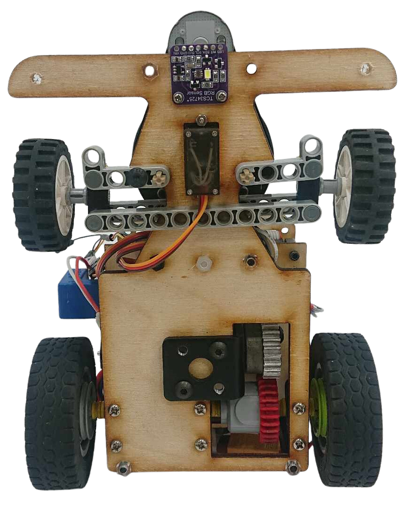
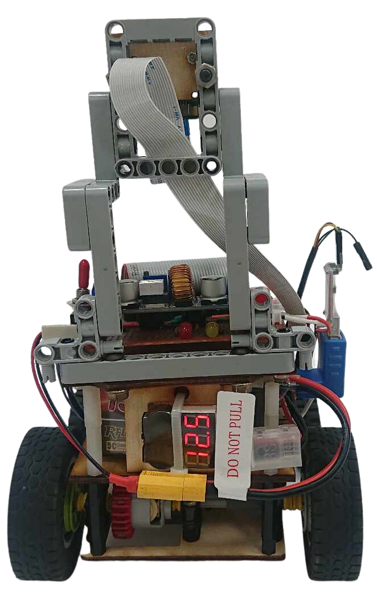
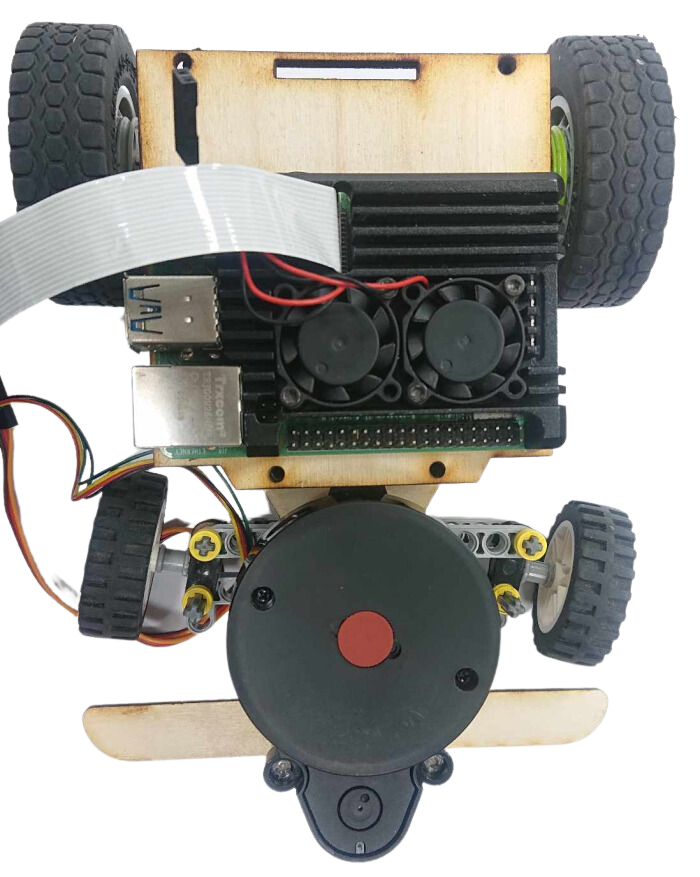

2023WRO Future Engineers Fire On All Cylinders  
=====
- ## Vehicle's photos(車輛照片)

<table>
  <tr>
    <td align="center" font size="5">Top view 上視圖</td>
    <td align="center" font size="5">Bottom view 下視圖 </td>

  </tr>
    <tr>
    <td> </td>
    <td></td>
  </tr>
    <tr>
    <td align="center" font size="5"> Front view 前視圖</td>
    <td align="center" font size="5">Rear view 後視圖 </td>
  </tr>
    </tr>
    <tr>
    <td></td>
    <td></td>
  </tr>
      <tr>
    <td align="center" font size="5">Left view 左視圖</td>
    <td align="center" font size="5">Right view 右視圖</td>
  </tr>
    </tr>
    <tr>
    <td></td>
    <td> </td>
  </tr>
</table>
  

 

- ## Mechanical Structure (機體結構)

<table>
  <tr>
      <th>Inner Structure Top View of the Overall Apparatus(整體機體結構上視圖) </th><th>Middle Layer Structure Top View(中層機體結構上視圖)</th><th>Top View of Vehicle Chassis(車輛底盤上視圖)</th>
  </tr>
  <tr>
     <td>   </td><td></td><td></td>
  </tr>
</table>

# 
[Return Home](../)
 
