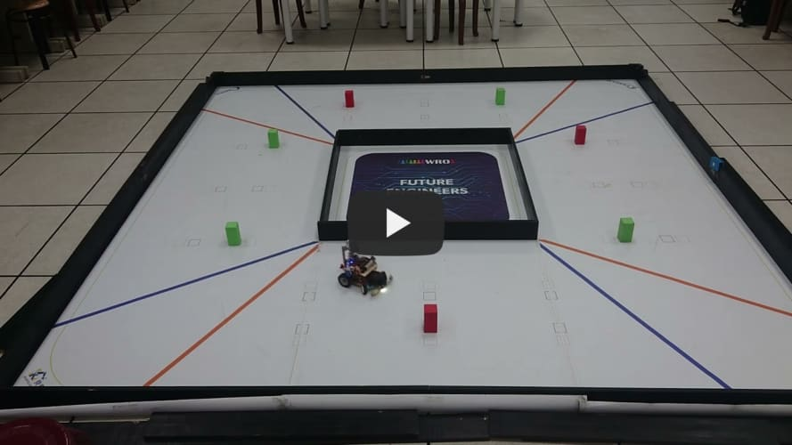
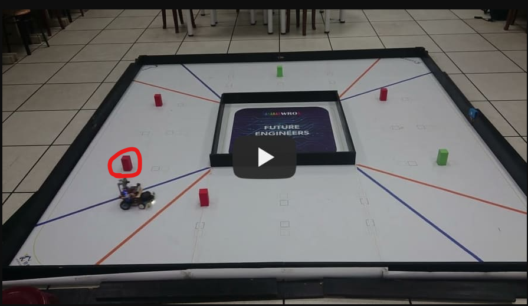
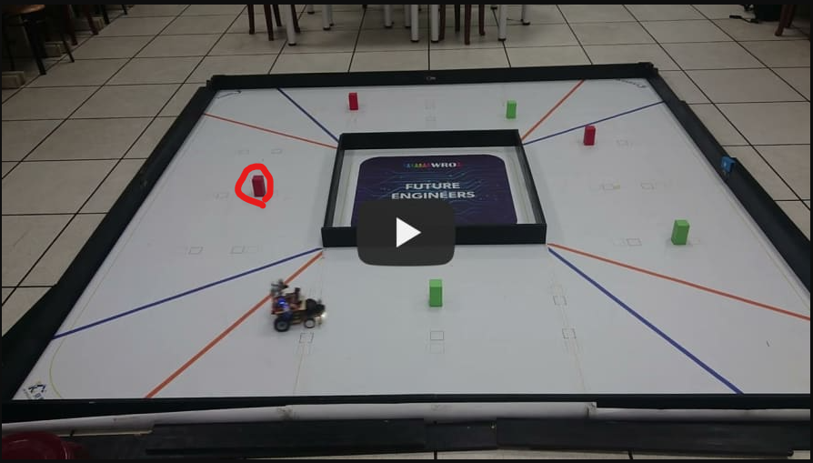
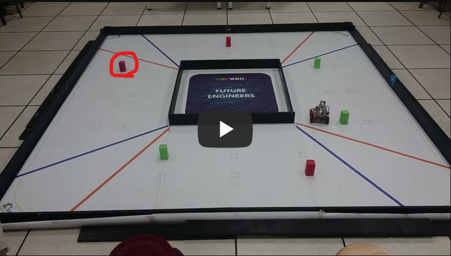

## 
Testing Video of Self-Driving Car in Obstacle Challenge

- #### The last traffic light on the second lap is a green signal.(No need to turn around ) 

  Here is a test video of a vehicle on the second lap, with the last traffic light being green. 

|The last traffic light on the second lap is a green signal.|
|:---:|
||

- #### The last traffic light on the second lap is red.(Need to turn around)  

  Here are test videos of the last traffic light being red in different positions on the second lap.  

|At Position 1|At Position 2|At Position 3|
|:---:|:---:|:---:|
||||

 - ### Explanation to Obstacle Challenge

  

# 
[Return Home](../../)
  

