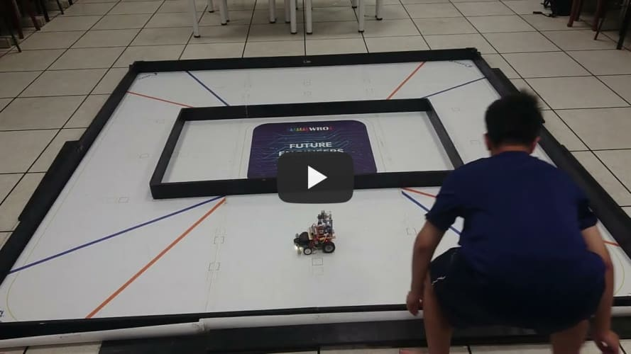
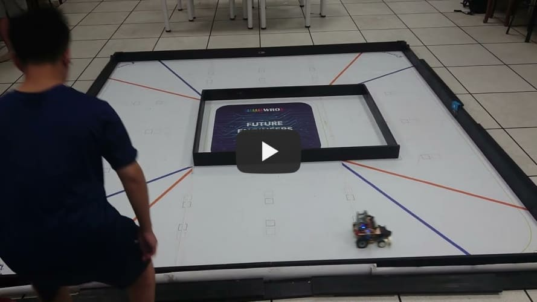

## 
Testing Video of Self-Driving Car in Open Challenge
 
以下為車輛在不同馬力及不同場地組合的測試影片。  
Here are test videos of vehicles in different power and field combinations.

- ### Full width(全寛)
  這是車輛在場地設定為"寬-寬-寬-寬"時的測試影片。  
  This is a test video of a vehicle in a field set to "wide-wide-wide-wide".

|Power 50 |Power 70|
|:----:|:----:|
|||

- ### Half-width half-height(半窄半寬)
  這是車輛在場地設定為"寬-窄-寬-窄"時的測試影片，其困難度有提高。  
  This is a test video of a vehicle in a "wide-narrow-wide-narrow" field configuration, which is more difficult.
  
|Power 50 |Power 70|
|:----:|:----:|
|||

- ### Full-width narrow(全窄)

    這是車輛在場地設定為"窄-窄-窄-窄"時的測試影片，因為所有的道路寬度都縮小，這會使機器的校正空間縮小，轉彎過頭很容易撞擊牆壁。  
      This is a testing video of the vehicle on a course set as 'narrow-narrow-narrow-narrow.' As all road widths have been reduced, this results in a limited correction space for the machine, making it easy for it to overshoot during turns and potentially collide with the walls.

|Power 50 |Power 70|
|:----:|:----:|
|||

- ### wide narrow wide narrow 寬窄寬窄
這是車輛在場地設定為"寬-窄-寬-窄"時，分別錄製順時針、逆時針的測試影片。  
These are test videos of a vehicle in a "wide-narrow-wide-narrow" field configuration, recorded clockwise and counterclockwise.

|Clockwise順時針|Counter Clockwise 逆時針|
|:---:|:---:|
| ||
# 
[Return Home](../../)
  

> from kirk@snjh.tc.edu.tw
